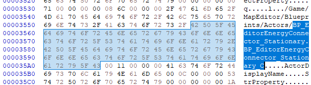
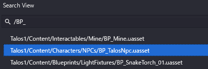
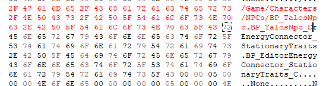
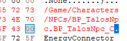
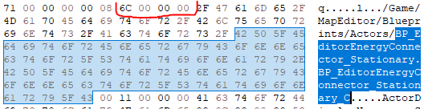

# How to Replace Blueprints

You can try to replace blueprints in your `.level` files with any blueprints you find in the game files.\
There is a short guide provided by **KabanFriend**.

> **⚠️ Warning**
>
> Modifying `.level` files can potentially corrupt them. 
> **Always** back up your original file before making changes and proceed at your own risk.

1. Place a stationary connector in your map and save it (this is the object with the longest file name)
2. Open the map file in a hex editor. I use HxD but any editor should work
3. Find `BP_EditorEnergyConnector_Stationary` (⚠️ NOT the one followed by `Traits`)\
   
4. Open TTP:R's game files in a tool that can browse UE5's asset files (I use [FModel](https://fmodel.app/))\
   The asset files are located in `<TTP:R directory>/Talos1/Content/Paks`
5. Look for new blueprint file that you want to place in your map (Blueprints usually start with `BP_`)\
   
6. Copy the asset path and edit it so that\
   `Talos1/Content/Characters/NPCs/BP_TalosNpc.uasset`\
   turns into:\
   `/Game/Characters/NPCs/BP_TalosNpc.BP_TalosNpc_C`\
   (Replace `Talos1/Content` with `/Game` & replace `uasset` with `<blueprint name>_C` at the end)
7. Go back to the level file you found in step 3 and replace bytes starting from `/Game`\
   (⚠️ Do NOT append/remove any bytes from the file! Changing the file length will make the level file invalid)\
   
8. Finally, add byte `00` after the very end of the asset path you pasted\
   
9. If the name of the blueprint is longer than name of stationary connector,
   then you'll need to modify the first 4 bytes of the asset path:
   \
   This part means a number of characters in next string. You can replace `6c` (it's decimal `107`)
   with another number that corresponds to the new string's length, taking into account `00` byte at the end.
